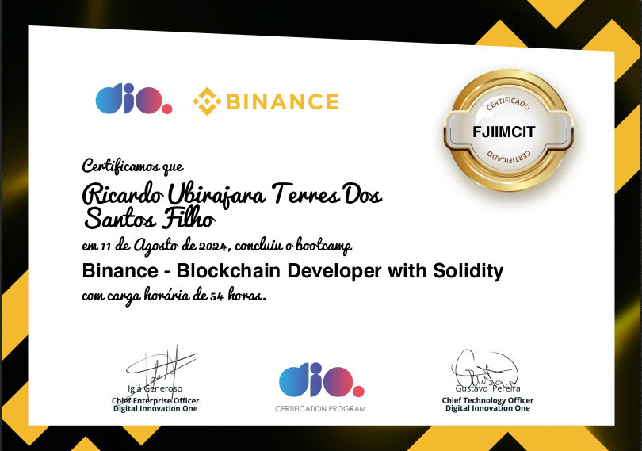

# Dio.me - Blockchain Developer with Solidity

Seja bem vind@ ao repositório onde se encontram os projetos desenvolvidos durante o evento da DIO, Blockchain Developer with Solidity.

Neste bootcamp, aprendemos conceitos de Blockchain, como as criptomoedas realmente funcionam, uso da Solidity, a linguagem de programação para manipular smart contracts, criação da sua própria criptomoeda na Rede Ethereum e um NFT temático.

## Projetos

* [Criando e Utilizando a Sua Carteira de Criptomoedas](/Criando_Utilizando_Carteira_Criptomoedas/): Criando e Utilizando Carteira de Criptomoedas na Testenet.
* [Criando Primeira Criptomoeda da Rede Ethereum](/Criando_Primeira_Criptomoeda_Rede_Ethereum/): Criando um contrato Solidity que implementa um token ERC20.
* [Criando Primeiro Token do Zero nos Padrões Web3](/Criando_Token_Padrões_Web3/): Criando um contrato inteligente para criar um token ERC20 chamado RICO Coin.

## Certificado

  

